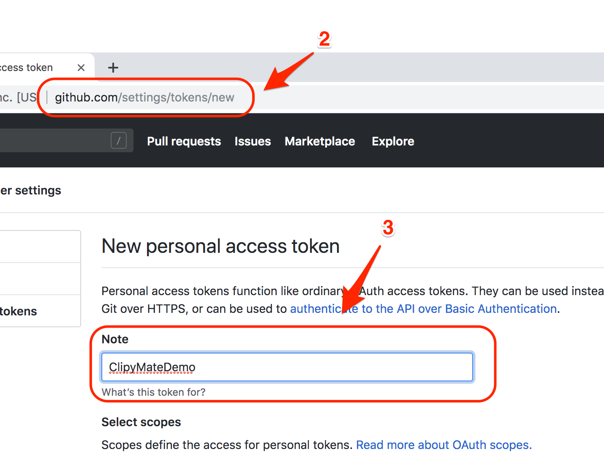
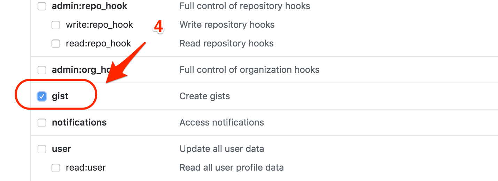
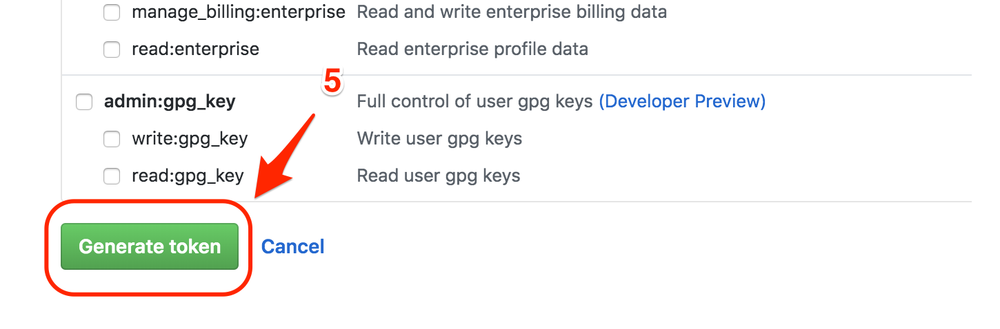
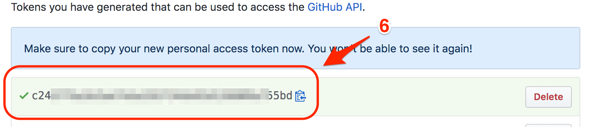

# Clipy Mate Cli
[](https://badge.fury.io/js/clipy-mate-cli)
[](https://snyk.io//test/github/jerrywdlee/clipy-mate-cli?targetFile=package.json)
[](https://www.npmjs.com/package/clipy-mate-cli)

Sync Your [Clipy](https://clipy-app.com/) Snippets to Gist.  
Powered by [Clipy Mate Core](https://github.com/jerrywdlee/clipy-mate-core) and inspired by [Settings Sync](https://github.com/shanalikhan/code-settings-sync).

## Introduction
[Clipy](https://github.com/Clipy/Clipy) is a Clipboard extension app for macOS. Clipy Mate Cli allow user sync Clipy's snippets to their GitHub gist.  

**[Attention]** This package will access Clipy's [Realm](https://realm.io/) Database directly, so you may need to restart Clipy App if snippets downloaded.

## Table of Contents
- [Introduction](#introduction)
- [Requirements](#requirements)
- [Installation](#installation)
- [Usage](#usage)
  - [Get Your GitHub Token](#get-your-git-hub-token)
  - [User Interface](#user-interface)
  - [Command Line](#command-line)
  - [Config File](#configuration-file)
- [Contributing](#contributing)
- [License](#license)


## Requirements
- MacOS 10.10 and over
- Clipy v1.1.2 and over
- Node.js v8.9.0 and over

## Installation

Use the package manager [npm](https://www.npmjs.com/) to install.

```bash
$ npm i -g clipy-mate-cli
$ clipy-mate
```

Or just run it by `npx` command

```bash
$ npx clipy-mate-cli
```

## Usage
### Get Your GitHub Token
1. Login Your GitHub account
2. Visit https://github.com/settings/tokens/new
3. Input **Note** like `Clipy-Mate`
4. Check the **gist** checkbox
5. Click **[Generate token]** botton
6. Copy the token and memo it

  
  
  
  

### User Interface

```sh
$ clipy-mate
```

#### Upload Snippets
[](https://asciinema.org/a/iHafYV2T778U2NpWrrFgoMJa4)

#### Download and Merge Snippets
[](https://asciinema.org/a/EH7s2Jck0VHgtDbeZKFptFz2H)

#### [Danger!] Download and Reset local snippets
[](https://asciinema.org/a/ryK1bbxkQgvEsbQfwVq2cWQts)

#### Show Helper
[](https://asciinema.org/a/4TJqdS2lHkT6Po6Pm3lpntGTY)

### Command Line
*You can register commands below as cron jobs.*

```sh
# helper
$ clipy-mate --help

# Create or Update GitHub Settings
$ clipy-mate -e -t <YOUR TOKEN> [-g <YOUR GIST ID>]

# Upload Clipy snippets
$ clipy-mate -u
# Or
$ clipy-mate --upload
# Or
$ clipy-mate upload

# Download and merge Clipy snippets
$ clipy-mate -m
# Or
$ clipy-mate --merge
# Or
$ clipy-mate merge

# [Danger!] Download and Reset local snippets
# It will delete all local snippets
$ clipy-mate -f
# Or
$ clipy-mate --force
# Or
$ clipy-mate force
```

### Configuration File

Configuration File saved at:

```sh
$HOME/.clipy-mate-cli/settings.json
```

## Contributing
Pull requests are welcome. For major changes, please open an issue first to discuss what you would like to change.

Please make sure to update tests as appropriate.

## [License](./LICENSE)
[BSD-3-Clause](https://opensource.org/licenses/BSD-3-Clause)
